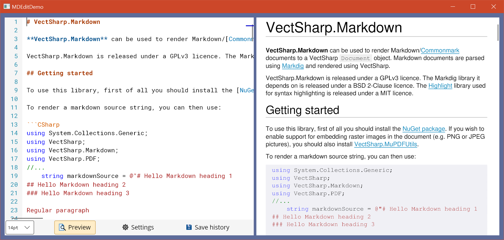

# MDEdit - A Markdown source code editor with syntax highlighting and real-time preview.


## Introduction

**MDEdit** is a Markdown source code editor control for [Avalonia](https://github.com/AvaloniaUI/Avalonia) applications.

This library provides a control that can be added to Avalonia windows and integrates:

* A code editor with search/replace functions and syntax highlighting.

* A panel showing a preview of the document.

* A panel showing the save history of the file (that can persist across different sessions, if the application implements it properly).

* A panel with general settings.

It uses a modified version of [CSharpEditor](https://github.com/arklumpus/CSharpEditor/) for the source code editor panel, and [VectSharp.Markdown](https://github.com/arklumpus/VectSharp/tree/master/VectSharp.Markdown) to render the Markdown document preview.

MDEdit is a .NET Standard 2.1 library, and should be usable in .NET Core 3.0+ and .NET 5.0+ projects. It is released under a GPLv3 licence. You can find the full documentation for this library at the [documentation website](https://arklumpus.github.io/MDEdit). A [PDF reference manual](https://arklumpus.github.io/MDEdit/MDEdit.pdf) is also available.

<p align="center">

</p>

## Getting started

First of all, you need to install the [NuGet package](https://www.nuget.org/packages/MDEdit/) in your project.

The editor control cannot be added directly to the Window in XAML code, because it requires some non-trivial initialisation; you can create a new `Editor` control using the static method `Editor.Create` and then add it to the window:

```CSharp
using MDEdit;

// ...
    Editor editor = await Editor.Create();

    Grid grid = this.FindControl<Grid>("EditorContainer");
    grid.Children.Add(editor);
```

The first time an `Editor` control is added to your window may take some time to initialise; subsequent `Editor` controls will be created much faster.

The `Editor.Create` static method has multiple parameters, all of which are optional:

* `string initialText`: this is simply the initial source code that is shown in the control when it is created.

* `string guid`: this parameter provides an identifier for the control. This will be used, in particular, to store the save history of the file. If the control is initialised with the same `guid` across different sessions, the save history of the file will be restored.

* `Shortcut[] additionalShortcuts`: this makes it possible to display additional application-specific shortcuts in the shortcut section of the settings panel. Note that this does not actually implement the shortcut behaviour (which needs to be implemented separately by the developer) - it is simply provided so that users can open the settings panel and see all the shortcuts that can be used with the editor in the same place.

Take a look at the [`MainWindow.xaml.cs` file](https://github.com/arklumpus/MDEdit/blob/master/MDEdit/MainWindow.axaml.cs) in the MDEditDemo project to see how this works in practice.
